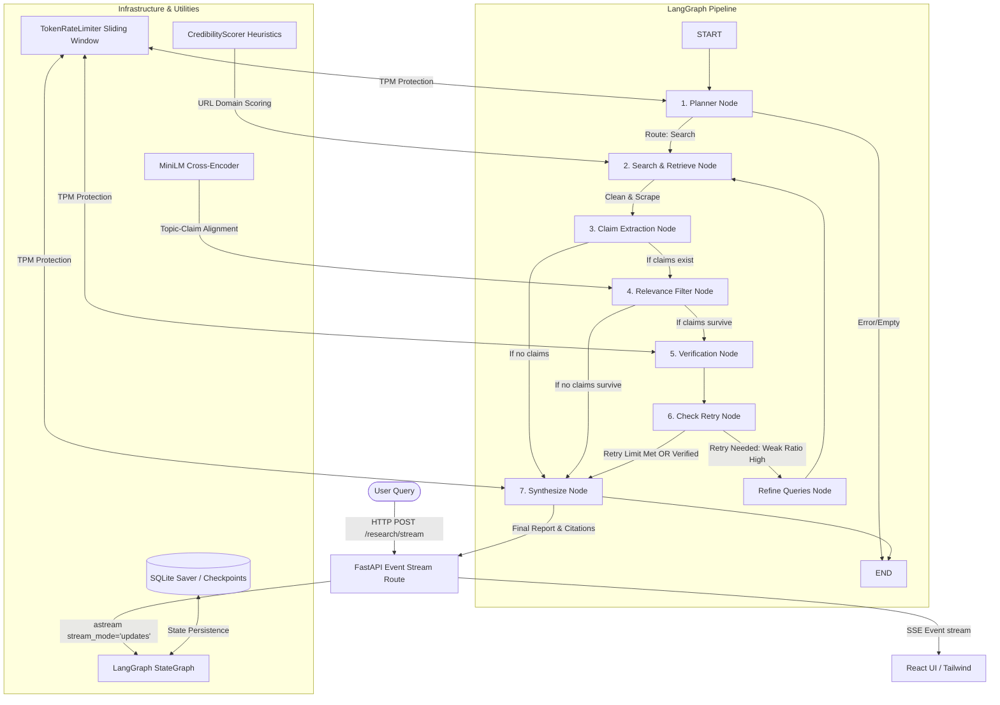

# 📐 Systems Architecture & Technical Blueprint: Deep Research & RAG Agentic Pipeline

This document provides a complete, end-to-end technical breakdown of the multi-source Research & RAG Agent. It covers the architecture, state transitions, agent nodes, processing modules, full-stack streaming setup, and reliability patterns implemented in the codebase.

---

## 1. High-Level System Architecture

The application is an enterprise-grade AI Research assistant consisting of three main layers:
1. **Frontend**: A React + Vite SPA built using vanilla CSS and Tailwind CSS, consuming a Server-Sent Events (SSE) stream for real-time node updates and rendering interactive results, citations, and confidence tags.
2. **Backend Orchestrator**: A FastAPI web server hosting a stateful, checkpointed LangGraph state machine (`StateGraph`). It coordinates multiple LLMs and heuristic nodes in a structured research cycle.
3. **AI & Retrieval Engine**: Utilizes Tavily and SearXNG for web retrieval (with adapter hooks for Phase 2 local RAG Qdrant/BM25), local LLMs via Ollama (`qwen2.5:3b-instruct` for fast claim extraction), and hosted LLMs via Groq/OpenAI for planning, verifying, and writing.



---

## 2. Stateful LangGraph Orchestration

### Why LangGraph?
Traditional LLM chains are linear and fail when tasks require loopback or conditional retries (such as re-evaluating sources when initial facts are conflicting or unconfirmed). LangGraph models the research workflow as a cyclic state machine. The state is represented by a shared `ResearchState` schema that is updated by each node.

### The ResearchState Schema ([state.py](file:///d:/ngxp_internship/multi_source_researcher/backend/src/state.py))
The state flows through the graph, storing all inputs, intermediate steps, and final results:
- **Topic & Plan**: `research_topic`, `plan` (objectives, sub-queries, complexity).
- **Search Artifacts**: `search_results`, `credibility_scores`, `tried_queries`.
- **Claims**: `claims` (raw atomic claims extracted from documents), `verified_claims` (list of `VerificationVerdict` objects).
- **Tracking & Control**: `retry_count`, `confirmed_claims`, `weak_claims_to_resolve`, `current_stage`, `stage_timings`, `token_tracker`.
- **Outputs**: `final_report`, `citations`.

---

## 3. Node-by-Node Architecture (From A to Z)

Here is how a user query travels through each node in the LangGraph graph defined in [graph.py](file:///d:/ngxp_internship/multi_source_researcher/backend/src/graph.py).

### A. Planner Node (`plan` in [planner.py](file:///d:/ngxp_internship/multi_source_researcher/backend/src/agents/planner.py))
- **Role**: Analyzes the query, categorizes complexity, and breaks it down.
- **Complexity Tiering**:
  - Automatically classifies the query into `simple`, `moderate`, or `complex`.
  - Simple lookups (e.g., "Who is...") are floor-rated to `simple`, capping search queries at 2.
  - Comparison topics (e.g., "A vs B") are rated `complex`, fanning out to up to 5 sub-queries.
- **Output**: Generates a `ResearchPlan` containing objectives, structured search queries, and a target report outline.

### B. Retriever Node (`search` in [retriever.py](file:///d:/ngxp_internship/multi_source_researcher/backend/src/agents/retriever.py))
- **Parallel Fan-out**: Spawns concurrent HTTP/2 search requests (max 5 in parallel) to the search provider (Tavily/SearXNG).
- **Resilient Retrieval**: Bounded search tasks are wrapped in a retry-on-failure backoff block (3 attempts), ensuring transient API timeouts don't fail the node.
- **Content Scrape**: For each result, the `ContentExtractor` opens the URL and pulls full page text (not just short snippets).
- **Exact & Near Dedup** ([dedup.py](file:///d:/ngxp_internship/multi_source_researcher/backend/src/processing/dedup.py)):
  - **Exact URL Match**: Normalizes URLs to strip tracking parameters and filters exact duplicates.
  - **Near-Duplicate Filter**: Performs Jaccard similarity scoring over k-shingles of text (entirely in plain python, avoiding costly embedding calls).
- **Credibility Filter** ([credibility.py](file:///d:/ngxp_internship/multi_source_researcher/backend/src/processing/credibility.py)):
  - Scores domains (e.g., `.edu`/`.gov` receive a +15 boost, custom trusted news domains get +25, suspicious TLDs get -25).
  - Drops sources below a minimum credibility score threshold (default 40).
- **Retry Allocation**: Reserves 30% of document extraction slots for newly discovered links during retry iterations, ensuring fresh evidence isn't crowded out by previous run results.

### C. Claim Extraction Node (`extract_claims` in [claim_extractor.py](file:///d:/ngxp_internship/multi_source_researcher/backend/src/agents/claim_extractor.py))
- **Granular Deconstruction**: Converts lengthy webpage contents into atomic, testable claims (e.g., `"The company raised $12M on July 4"`).
- **Local Model Optimization**: Uses a fast local Ollama model (`qwen2.5:3b-instruct`) running concurrently to perform the extraction, protecting costly Groq API token limits.
- **Boilerplate & Safety Limits**:
  - Filters out headers, sign-in links, and privacy notices.
  - Caps claims at 15 per document to prevent downstream verifier token explosions.

### D. Relevance Filter Node (`relevance_filter` in [relevance.py](file:///d:/ngxp_internship/multi_source_researcher/backend/src/utils/relevance.py))
- **Problem**: Claim extraction can generate a large volume of claims, many of which are trivia or off-topic.
- **Cross-Encoder Reranker**: Employs the `ms-marco-MiniLM-L-6-v2` cross-encoder to compute query-claim alignment scores.
- **Rank-Based Filtering**: Since raw logit scores drift depending on document context, it uses a relative rank-based cut (keep top 65%, minimum 5) rather than a fixed cutoff.
- **Claim Boost & Floor**:
  - Nudges specific claim types (like dates and statistics) when scores are close.
  - Implements a *per-source floor* (minimum 1 claim per document) so a single dominant document does not starve other sources.

### E. Verification Node (`verify` in [verifier.py](file:///d:/ngxp_internship/multi_source_researcher/backend/src/agents/verifier.py))
- **Groundedness Verifier**: Evaluates every claim against its corresponding source text.
- **Excerpts Anchor**: Instead of feeding entire 8k webpages to the LLM verifier (which triggers rate limit errors), it extracts text windows (2,000 chars) around keyword anchors for each claim.
- **Confidence Tiers**:
  - `verified`: Grounded in a source + corroborated by at least 1 other independent source.
  - `single_source`: Grounded in a source but no other source mentions it.
  - `unconfirmed`: Source text does not support the claim.
  - `conflicting`: Multiple sources directly contradict each other on this claim.
- **Targeted Re-verification**: During retry loops, it skips claims already verified on a prior pass and only runs the verifier on newly extracted claims.

### F. Check Retry Node (`check_retry` in [graph.py](file:///d:/ngxp_internship/multi_source_researcher/backend/src/graph.py))
- **Evaluation**: Calculates the ratio of unconfirmed/conflicting claims. If this ratio exceeds the threshold and retries remain, it loops.
- **Data Banking**: Banks all confirmed claims in `confirmed_claims` to avoid re-verifying them.
- **Search Query Refinement**: Extracts unconfirmed claims, transforms them into target queries, and routes back to the retriever to seek corroborating evidence.

### G. Synthesizer Node (`synthesize` in [synthesizer.py](file:///d:/ngxp_internship/multi_source_researcher/backend/src/agents/synthesizer.py))
- **Bottom-Up Synthesis**: Instead of asking an LLM to write a report and cite its sources (which leads to hallucinations), the synthesizer is supplied *only* with verified/single-source claims.
- **Output Formats**:
  - Simple topics receive a brief, direct-answer format.
  - Complex topics receive a comprehensive, structured report aligned with the planned outline.
- **APA Citation Engine** ([citations.py](file:///d:/ngxp_internship/multi_source_researcher/backend/src/processing/citations.py)): Maps the final text references back to the unique source URLs, producing an APA citation list with confidence indicators.

---

## 4. Enterprise-Grade Reliability Engineering

The system incorporates several crucial architectural patterns for performance and rate-limit safety:

### Sliding-Window Token Rate Limiter ([token_rate_limiter.py](file:///d:/ngxp_internship/multi_source_researcher/backend/metrics/token_rate_limiter.py))
Groq free tier enforces a strict 8,000 Tokens-Per-Minute (TPM) budget.
1. **Pre-call Reservation**: The rate limiter calculates a fast approximation of the prompt tokens (`len(input) // 4`) and reserves this in a rolling deque.
2. **Cooperative Sleep**: If the reservation exceeds the 90% budget safety margin, the caller yields and sleeps until older requests slip out of the 60-second sliding window.
3. **Ledger Correction**: A post-call callback intercepts the actual API response token usage, updating the reservation deque with the precise values in real-time.

### HTTP Circuit Breakers ([http_client.py](file:///d:/ngxp_internship/multi_source_researcher/backend/src/utils/http_client.py))
Protects the pipeline from hang-ups if external scrapers or search providers encounter severe rate limits or downtime.
- **State Machine**: Transitions from `CLOSED` (healthy) $\rightarrow$ `OPEN` (failing fast) $\rightarrow$ `HALF_OPEN` (testing recovery).
- **Fast Fail**: Instantly blocks requests to a broken provider and raises `CircuitOpenError`, allowing the graph to gracefully fall back or proceed with cached data.

### Checkpointing & Crash Recovery
- **LangGraph Checkpointer**: Every step of the graph is written to an SQLite database ([AsyncSqliteSaver](file:///d:/ngxp_internship/multi_source_researcher/backend/src/graph.py#L68-L70)).
- **State Resumability**: If a long-running research job crashes or is interrupted, it can be resumed instantly via its `thread_id` by loading the last saved checkpoint state, avoiding repeating search or extraction costs.

---

## 5. Full-Stack SSE Streaming & Client Consumption

A core strength of the application is the live progress updates streamed directly to the UI.

```
+------------------+                   +----------------------+                   +----------------+
|  LangGraph Node  | --Update State--> |  FastAPI /stream API | --SSE Stream----> |  React App     |
| (e.g. Plan Done) |                   |  (astream updates)   |  (EventSource)    |  (useResearch) |
+------------------+                   +----------------------+                   +----------------+
```

### The Stream Route ([main.py:L64](file:///d:/ngxp_internship/multi_source_researcher/backend/main.py#L64-L88))
- FastAPI opens a persistent HTTP connection using Server-Sent Events (`EventSourceResponse`).
- It iterates over the async stream generator `graph.astream(..., stream_mode="updates")`.
- When a node finishes, the backend intercepts the update, formats it into a summary payload (e.g., number of search results, verified claim counts), and streams it under the `node_update` event name.

### Frontend Consumption ([useResearchStream.js](file:///d:/ngxp_internship/multi_source_researcher/frontend/src/hooks/useResearchStream.js))
- The custom React hook `useResearchStream` initializes a custom reader over the stream response.
- As chunks arrive, they are decoded and parsed.
- The hook maintains a reactive status array `nodeLog` which updates the progress sidebar in the UI, transitioning from `planning` $\rightarrow$ `searching` $\rightarrow$ `extracting_claims` $\rightarrow$ `verifying` $\rightarrow$ `synthesizing` live as the agent operates.

---

## 6. How to Run, Test, & Evaluate

### Local Development Setup
1. **Backend**:
   - Install dependencies: `pip install -r requirements.txt`
   - Start Ollama and pull required models: `ollama run qwen2.5:3b-instruct`
   - Set environment variables in `.env` (e.g., `TAVILY_API_KEY`, `GROQ_API_KEY`).
   - Run server: `python main.py` (runs on `http://localhost:8001`).
2. **Frontend**:
   - Install packages: `npm install`
   - Start development server: `npm run dev` (runs on `http://localhost:5173`).

### Running the Evaluation Harness
The codebase includes a dedicated evaluation framework (`run_eval.py`) to systematically test performance changes before moving to Phase 2 (local RAG):
- **Golden Questions**: A JSON suite of standard questions (simple, multi-source, conflicting, insufficient evidence).
- **Execution**: Run `python src/eval/run_eval.py` to trigger parallel research runs with checkpointing disabled.
- **Metrics Tracked**:
  - **Retrieval Hit Rate**: Accuracy of scraped documents.
  - **Claim Grounding Rate**: Ratio of verified vs unconfirmed claims.
  - **Stage Latencies**: Breakdown of time spent across each graph node.
  - **Citations Accuracy**: Verification of generated references.
